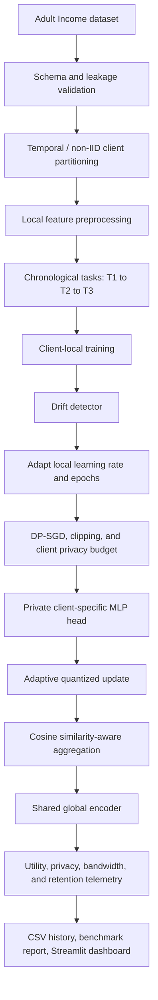

# PrivacyBench-FL

**An adaptive, privacy-aware, personalized federated-learning benchmark for
heterogeneous tabular clients.**

PrivacyBench-FL is built around the real trade-offs that make federated learning
interesting: clients do not have identical data, identical privacy policies, or
identical bandwidth. Rather than presenting a plain FedAvg loop, the project
combines personalization, similarity-aware aggregation, adaptive compression,
drift response, and continual-learning analytics in one reproducible pipeline.

## Why this project stands out

- **Similarity-aware federated aggregation** — cosine similarity identifies
  updates aligned with the round consensus, making aggregation more robust to
  heterogeneous client behavior.
- **Personalized federated learning** — the MLP learns a shared encoder while
  every client retains a private classification head. One system, locally
  specialized decisions.
- **Per-client privacy governance** — each client receives and tracks its own
  RDP epsilon budget, so a privacy-sensitive institution can stop contributing
  before its budget is exceeded.
- **Adaptive communication** — 16-bit precision is used while updates are
  volatile; the system moves to 4-bit transmission as learning stabilizes.
- **Real drift response** — the system detects local feature-distribution
  changes and adapts learning rate and local epochs automatically.
- **Continual-learning benchmark** — clients learn through T1 → T2 → T3 and
  explicitly measure retention, absolute forgetting, and backward transfer.
- **End-to-end observability** — every run records utility, privacy,
  communication, client similarity, active task, and retention telemetry.

## Full project flow



See [the detailed visual flow](docs/PROJECT_FLOW.md) and [the feature showcase](docs/FEATURES.md).

## Architecture at a glance

| Layer | Responsibility |
|---|---|
| `preprocessing/` | schema checks, client partitions, local transformations, temporal task construction |
| `models/` | logistic-regression baseline and personalized MLP |
| `federated/` | clients, server, similarity-aware aggregation, trainer, selection |
| `privacy/` | DP-SGD bridge, clipping, quantization |
| `continual_learning/` | temporal drift simulation, detection, and forgetting analytics |
| `evaluation/` | privacy accounting, metrics, bandwidth, early stopping, reports |
| `dashboard/` | Streamlit interface for experiment results |

## Run

```powershell
python -m pip install -r requirements.txt
python main.py
streamlit run dashboard/app.py
```

## Clean, reproducible runs

By default, every `python main.py` run removes the prior generated report,
result arrays, training CSV, and checkpoint contents before starting. It never
removes source data, client partitions, code, or configuration. Set
`logging.clear_previous_outputs: false` in `config.yaml` to retain prior
generated artifacts.

## Key configuration choices

```yaml
aggregation:
  strategy: similarity_aware
personalization:
  enabled: true
quantization:
  adaptive: true
privacy_budgets:
  client_0: 1.0
  client_1: 2.0
  client_2: 3.0
drift_detection:
  enabled: true
```

The project reports per-client RDP estimates for research comparison; it is not
a substitute for a production privacy review.
